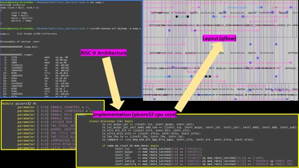

# VSD_ChipDesign_Workshop_Documentation
<h2>Advance Physical Design using OpenLANE Sky130</h2>
Author: Anurag Devidas Biradar
  
This is my summary for VSD Workshop on Chip designing using Google Skywater 130nm PDK process using <a href="https://github.com/efabless/openlane2">OpenLANE</a> tool chain flow.
<h2>Introduction to Workshop</h2>
This workshop was about giving tutorial of Advance Physical Design using Openlane SKY130.
<h3>Day_1: Inception of Open Source EDA, OpenLANE and SKY130 PDK</h3>
<h4>How to talk to computers?</h4>

<b>Introduction to QFN-48 Package, Chip, Pads, Core, Die and IPs</b>

 
Arduino Leonardo is a common example of electronics board. It is based on ATmega32u4 chip, and for which we are intrested about. 
  
  

  
Basic fundamental terminologies:
  
<b>Package:</b>
It is a housing in which ICs are placed. Ex: QFN48 (i.e., Quad Flat No-Lead Package with 48 leads) is one of kind of package in market.
  
<b>Wire bonds:</b>
It is an electrical interconnection between pins and chip.  
 
<b>Pads:</b>
Metal connections on IC package which provide electrical connection between chip and PCB.
  
<b>Core:</b>
It is a place where all the digital logic (such as AND gate, OR gate, etc.) is placed. 
  
<b>Die:</b>
It is small piece of semiconductor material on which IC is fabricated. Also, die contains many number of cores in it. 
  
<b>Foundry IPs:</b>
Foundry IPs (Intellectual Property) are predesigned blocks which can be directly used by customers of that foundry. It includes blocks like SRAM, ADC, DAC, PLL, etc.
  
<b>Macros:</b>
It is pieces of predesigned logic blocks which can be used without need of designing them from start. 
 

<b>Introduction to RISC-V</b>

 
If a C language program needs to be run on a hardware/chip which has a certain layout then there should be some flow which passes information from C language to the hardware.
  
Following flow is followed:
  
1. First, the C language program is compiled to its Assembly language program.
  
2. Then this Assembly loanguage program is converted to Machine language program (Binary language program i.e., 1's & 0's). 
  
3. Now this binary language program is understood by the hardware in terms of Logic 1 and Logic 0.
  
4. And we get the required output.
  
There is need of another interface to be present between RISC-V architecture and Layout. It is nothing but the Hardware Description Language (HDL).
To implement this RISC-V specifications in RTL we need HDL. And then after it forms RTL to GDSII flow.
  

<b>From Software Applications to Hardware</b>

 
How apps run on hardware? Curious about how all does this happen? Well to some extent it depends on ISA (Instruction Set Architecture). So, the following flow is followed for every application to run on hardware:
  
1. Application enters into a block called system software.
  
2. In turn the system software converts this application program into the binary language.
  
Major components of system software are: 
  
1. OS (Operating System)  
It handles IO operations, allocates memory, etc. Converts application program into the small C, C++ or Java language programs. 
  
2. Compiler  
Now these small C, C++ programs are converted into the instructions. Syntax of these instructions vary depending on the type of hardware it is. Ex: Intel86, ARM, MIPS, RISC-V.
  
3. Assembler  
Now these instructions are taken by Assembler and converts it into its respective binary number. Also called as machine language program. 
  
Now this binary numbers are fed to the hardware; hardware understands it, performs respective function and generates the output. 
Ex: Stopwatch App.

OpenLANE is an automated tool chain for RTL to GDSII flow. 
It includes various tools like Yosys, OpenSTA, OpenROAD, Magic, Netgen and other such Custom Scripts for designing and optimization.
